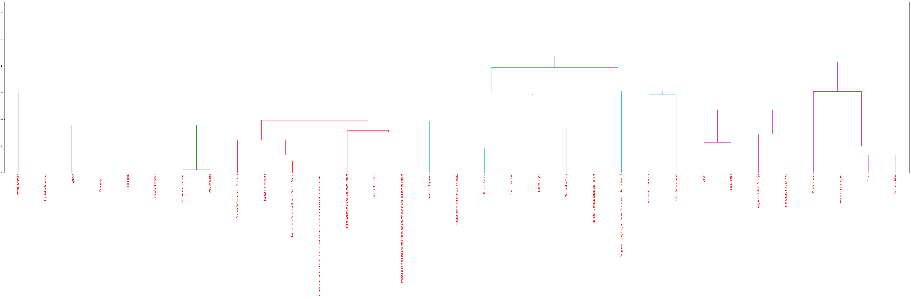
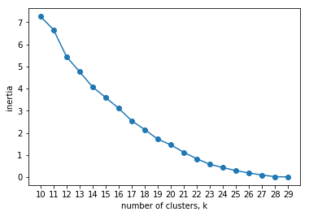

```python
# Import modules
import numpy as np
import pandas as pd
import nltk

# Set seed for reproducibility
np.random.seed(5)

xls = pd.ExcelFile('Glossary.xls')
xls.sheet_names
```


    ['Glossary', 'alternative_tag', 'subject_type']


```python
glossary_df = xls.parse('Glossary')
print(glossary_df.head())
```

      language  subject_id                                   keyword  \
    0      chi           0                                   國際收支平衡表   
    1      eng           0                               BoP account   
    2      chi           0                         甲類、乙類、丙類及綜合消費物價指數   
    3      eng           0  CPI(A), CPI(B), CPI(C) and Composite CPI   
    4      chi           0                                        死亡   
    
      simplified_definition                                  detail_definition  
    0                   NaN       國際收支平衡表是有系統地載錄，在指定期間內，某經濟體系與世界各地的各類經濟交易的統計表。  
    1                   NaN  A BoP account is a statistical statement that ...  
    2                   NaN  綜合消費物價指數反映消費物價轉變對整體住戶的影響，而甲類、乙類及丙類消費物價指數則分別以開支...  
    3                   NaN  The Composite CPI reflects the impact of consu...  
    4                   NaN                         死亡指某人在活產後的任何期間，永久失去所有生命徵象。  
    


```python
subject_df = xls.parse('subject_type')
print(subject_df.head())
```

       id  subject_id       chi_name  \
    0   1          10  官方統計綜合報告及參考資料   
    1   2          20             人口   
    2   3          30             勞工   
    3   4          40           對外貿易   
    4   5          50    國民收入及國際收支平衡   
    
                                                eng_name  
    0  General Reports and References in Official Sta...  
    1                                         Population  
    2                                             Labour  
    3                                     External Trade  
    4            National Income and Balance of Payments  
    


```python
subject_df = subject_df.set_index('subject_id')
print(subject_df.head())
```

                id       chi_name  \
    subject_id                      
    10           1  官方統計綜合報告及參考資料   
    20           2             人口   
    30           3             勞工   
    40           4           對外貿易   
    50           5    國民收入及國際收支平衡   
    
                                                         eng_name  
    subject_id                                                     
    10          General Reports and References in Official Sta...  
    20                                                 Population  
    30                                                     Labour  
    40                                             External Trade  
    50                    National Income and Balance of Payments  
    


```python
theme_df = glossary_df[['subject_id', 'language', 'keyword', 'detail_definition']]
print(theme_df.head())
```

       subject_id language                                   keyword  \
    0           0      chi                                   國際收支平衡表   
    1           0      eng                               BoP account   
    2           0      chi                         甲類、乙類、丙類及綜合消費物價指數   
    3           0      eng  CPI(A), CPI(B), CPI(C) and Composite CPI   
    4           0      chi                                        死亡   
    
                                       detail_definition  
    0       國際收支平衡表是有系統地載錄，在指定期間內，某經濟體系與世界各地的各類經濟交易的統計表。  
    1  A BoP account is a statistical statement that ...  
    2  綜合消費物價指數反映消費物價轉變對整體住戶的影響，而甲類、乙類及丙類消費物價指數則分別以開支...  
    3  The Composite CPI reflects the impact of consu...  
    4                         死亡指某人在活產後的任何期間，永久失去所有生命徵象。  
    


```python
theme_df_pivot = theme_df.pivot(columns='language', values=['subject_id', 'keyword', 'detail_definition'])
# flatten multiindex
theme_df_pivot.columns = ['_'.join(col).strip() for col in theme_df_pivot.columns.values]
print(theme_df_pivot.head())
```

      subject_id_chi subject_id_eng        keyword_chi  \
    0              0            NaN            國際收支平衡表   
    1            NaN              0                NaN   
    2              0            NaN  甲類、乙類、丙類及綜合消費物價指數   
    3            NaN              0                NaN   
    4              0            NaN                 死亡   
    
                                    keyword_eng  \
    0                                       NaN   
    1                               BoP account   
    2                                       NaN   
    3  CPI(A), CPI(B), CPI(C) and Composite CPI   
    4                                       NaN   
    
                                   detail_definition_chi  \
    0       國際收支平衡表是有系統地載錄，在指定期間內，某經濟體系與世界各地的各類經濟交易的統計表。   
    1                                                NaN   
    2  綜合消費物價指數反映消費物價轉變對整體住戶的影響，而甲類、乙類及丙類消費物價指數則分別以開支...   
    3                                                NaN   
    4                         死亡指某人在活產後的任何期間，永久失去所有生命徵象。   
    
                                   detail_definition_eng  
    0                                                NaN  
    1  A BoP account is a statistical statement that ...  
    2                                                NaN  
    3  The Composite CPI reflects the impact of consu...  
    4                                                NaN  
    


```python
eng_df = theme_df_pivot[['subject_id_eng', 'keyword_eng', 'detail_definition_eng']]
eng_df.head()
```


<div>
<style scoped>
    .dataframe tbody tr th:only-of-type {
        vertical-align: middle;
    }

    .dataframe tbody tr th {
        vertical-align: top;
    }

    .dataframe thead th {
        text-align: right;
    }
</style>
<table border="1" class="dataframe">
  <thead>
    <tr style="text-align: right;">
      <th></th>
      <th>subject_id_eng</th>
      <th>keyword_eng</th>
      <th>detail_definition_eng</th>
    </tr>
  </thead>
  <tbody>
    <tr>
      <th>0</th>
      <td>NaN</td>
      <td>NaN</td>
      <td>NaN</td>
    </tr>
    <tr>
      <th>1</th>
      <td>0</td>
      <td>BoP account</td>
      <td>A BoP account is a statistical statement that ...</td>
    </tr>
    <tr>
      <th>2</th>
      <td>NaN</td>
      <td>NaN</td>
      <td>NaN</td>
    </tr>
    <tr>
      <th>3</th>
      <td>0</td>
      <td>CPI(A), CPI(B), CPI(C) and Composite CPI</td>
      <td>The Composite CPI reflects the impact of consu...</td>
    </tr>
    <tr>
      <th>4</th>
      <td>NaN</td>
      <td>NaN</td>
      <td>NaN</td>
    </tr>
  </tbody>
</table>
</div>


```python
eng_df = eng_df.dropna()
print(eng_df.head())
print(eng_df.describe())
```

      subject_id_eng                               keyword_eng  \
    1              0                               BoP account   
    3              0  CPI(A), CPI(B), CPI(C) and Composite CPI   
    5              0                                     Death   
    7              0                        Domestic household   
    9              0                          Employed persons   
    
                                   detail_definition_eng  
    1  A BoP account is a statistical statement that ...  
    3  The Composite CPI reflects the impact of consu...  
    5  A death refers to the permanent disappearance ...  
    7  Consist of a group of persons who live togethe...  
    9  Refer to those persons aged >=15 who have been...  
            subject_id_eng    keyword_eng  \
    count              728            728   
    unique              34            345   
    top                170  Establishment   
    freq                65              9   
    
                                        detail_definition_eng  
    count                                                 728  
    unique                                                414  
    top     Population by-census is a statistical project ...  
    freq                                                    6  
    


```python
# eng_df['concat'] = eng_df['keyword_eng'] + ' ' + eng_df['detail_definition_eng']
# eng_df = eng_df[['subject_id_eng', 'concat']]
# print(eng_df.head())
```


```python
eng_dfg = eng_df.groupby('subject_id_eng')
print(eng_dfg.get_group(0))
print(eng_dfg.get_group(0).info())
```

       subject_id_eng                               keyword_eng  \
    1               0                               BoP account   
    3               0  CPI(A), CPI(B), CPI(C) and Composite CPI   
    5               0                                     Death   
    7               0                        Domestic household   
    9               0                          Employed persons   
    11              0                       Exports of services   
    13              0              Gross Domestic Product (GDP)   
    15              0                          Imports of goods   
    17              0                       Imports of services   
    19              0                        Insurance services   
    21              0                              Labour force   
    23              0                        Nominal Wage Index   
    25              0                    Total exports of goods   
    27              0                   Total merchandise trade   
    29              0                      Underemployment rate   
    31              0                         Unemployment rate   
    32              0                                      yoy%   
    
                                    detail_definition_eng  
    1   A BoP account is a statistical statement that ...  
    3   The Composite CPI reflects the impact of consu...  
    5   A death refers to the permanent disappearance ...  
    7   Consist of a group of persons who live togethe...  
    9   Refer to those persons aged >=15 who have been...  
    11  Exports of services are the sales of services ...  
    13  GDP is a measure of the total value of product...  
    15  Imports of goods refer to goods which have bee...  
    17  Imports of services are the purchases of servi...  
    19  Insurance services cover all types of direct i...  
    21  Labour force refers to the land-based non-inst...  
    23  Nominal Wage Index measures the pure changes i...  
    25  Total exports of goods comprise domestic expor...  
    27  Total merchandise trade refers to all the move...  
    29  Underemployment rate refers to the proportion ...  
    31  Unemployment rate refers to the proportion of ...  
    32                     Year-on-year percentage change  
    <class 'pandas.core.frame.DataFrame'>
    Int64Index: 17 entries, 1 to 32
    Data columns (total 3 columns):
    subject_id_eng           17 non-null object
    keyword_eng              17 non-null object
    detail_definition_eng    17 non-null object
    dtypes: object(3)
    memory usage: 544.0+ bytes
    None
    


```python
# Since subject_id 0 is not a theme, but a predefined category
eng_clean_df = eng_df[eng_df['subject_id_eng'] != 0]
print(eng_clean_df)
```

         subject_id_eng                                        keyword_eng  \
    34               20                                 "De facto" concept   
    36               20                                  "De jure" concept   
    38               20                             Child dependency ratio   
    40               20                                   Crude birth rate   
    42               20                                   Crude death rate   
    44               20                                Crude marriage rate   
    46               20                                              Death   
    48               20                                 Domestic household   
    50               20                           Elderly dependency ratio   
    52               20                       Expectation of life at birth   
    54               20                       Extended "de facto" approach   
    56               20                                        Live births   
    58               20                                         Median age   
    60               20                       Median age at first marriage   
    62               20  Median Mortgage Payment and Loan Repayment to ...   
    64               20                        Median Rent to Income Ratio   
    66               20                                   Mobile Residents   
    68               20  Mortgage Payment and Loan Repayment to Income ...   
    70               20                                   Natural Increase   
    72               20                                       Net movement   
    74               20                           Overall dependency ratio   
    76               20                               Population by-census   
    78               20                                  Population census   
    80               20                             Population growth rate   
    82               20                                Registered marriage   
    84               20                               Rent to Income Ratio   
    86               20                                Resident population   
    88               20                                          Sex ratio   
    90               20                               Total fertility rate   
    92               20                                    Usual Residents   
    ...             ...                                                ...   
    1378            461                       Demographic dependency ratio   
    1379            461                         Economic dependency ratio    
    1380            461                           Economic activity status   
    1381            461                           Monthly household income   
    1382            461                                   Pre-intervention   
    1383            461                 Post-intervention (recurrent cash)   
    1384            461  Post-intervention (recurrent + non-recurrent c...   
    1385            461       Post-intervention (recurrent cash + in-kind)   
    1386            461                       Policy intervention measures   
    1387            461                                           Taxation   
    1388            461                            Recurrent cash benefits   
    1389            461                        Non-recurrent cash benefits   
    1390            461                                   In-kind benefits   
    1391            461                                            Persons   
    1392            461                        Economically active persons   
    1393            461                      Economically inactive persons   
    1394            461                                   Employed persons   
    1395            461                                  Full-time workers   
    1396            461                                  Part-time workers   
    1397            461                              Underemployed persons   
    1398            461                                 Unemployed persons   
    1399            461                                     Household head   
    1400            461                                  Unemployment rate   
    1401            461                                             Median   
    1402            461                                        Percentiles   
    1403            461                                 Poverty indicators   
    1404            461                                  Poverty incidence   
    1405            461                                       Poverty rate   
    1406            461                                        Poverty gap   
    1407            461                                       Poverty line   
    
                                      detail_definition_eng  
    34    Under a "de facto" concept, the population inc...  
    36    Under a "de jure" concept, all persons who usu...  
    38    Child dependency ratio refers to the number of...  
    40    Crude birth rate refers to the number of live ...  
    42    Crude death rate refers to the number of death...  
    44    Crude marriage rate refers to the number of ma...  
    46    A death refers to the permanent disappearance ...  
    48    A domestic household consists of a group of pe...  
    50    Elderly dependency ratio refers to the number ...  
    52    Expectation of life at birth refers to the num...  
    54    Under the "extended de facto" approach, the Ho...  
    56    A live birth refers to the complete expulsion ...  
    58    Median age is an indicator of the average age ...  
    60    Median age at first marriage is an indicator o...  
    62    It refers to the average percentage of monthly...  
    64    It refers to the average percentage of monthly...  
    66    The "Hong Kong Resident Population" comprises ...  
    68    It refers to the percentage of monthly househo...  
    70    Natural increase refers to the balance of live...  
    72    It is the number of inflow to a country/territ...  
    74    Overall dependency ratio refers to the number ...  
    76    Population by-census is a statistical project ...  
    78    Population census refers to a large-scale stat...  
    80    Population growth rate refers to the populatio...  
    82    A registered marriage is defined as a voluntar...  
    84    It refers to the percentage of monthly househo...  
    86    The practical definition of "resident populati...  
    88    Sex ratio refers to the ratio of the number of...  
    90    Total fertility rate refers to the average num...  
    92    The "Hong Kong Resident Population" comprises ...  
    ...                                                 ...  
    1378  Refers to the number of persons aged below 18 ...  
    1379  Refers to the number of economically inactive ...  
    1380  Households / population can be classified into...  
    1381  The total income earned by all member(s) of th...  
    1382  This income type only includes household membe...  
    1383  Refers to the household income after tax, incl...  
    1384  Refers to the household income after tax, incl...  
    1385  Refers to the household income after tax, incl...  
    1386  According to the discussion of Commission on P...  
    1387  Includes salaries tax and property tax, as wel...  
    1388  Refer to cash-based benefits / cash-equivalent...  
    1389  Refer to non-recurrent cash benefits provided ...  
    1390  Refer to in-kind benefits provided with means ...  
    1391  Refer to those persons residing in domestic ho...  
    1392  Synonymous with the labour force, comprise the...  
    1393  Include all persons who have not had a job and...  
    1394  For a person aged 15 or over to be classified ...  
    1395  Refer to employed persons who work 35 hours an...  
    1396  Refer to employed persons who work less than 3...  
    1397  The criteria for an employed person to be clas...  
    1398  For a person aged 15 or over to be classified ...  
    1399  A household head is acknowledged by other fami...  
    1400  Refers to the proportion of unemployed persons...  
    1401  For an ordered data set which is arranged in a...  
    1402  Percentiles are the 99 values that divide an o...  
    1403              Quantitative measurements of poverty.  
    1404  Refers to the number of poor households and th...  
    1405  The ratio of the poor population to the total ...  
    1406  Poverty gap of a poor household refers to the ...  
    1407  A threshold to define poor households and thei...  
    
    [711 rows x 3 columns]
    


```python
merged_series = eng_clean_df.groupby('subject_id_eng')['detail_definition_eng'].apply(' '.join)
print(merged_series)
```

    subject_id_eng
    20     Under a "de facto" concept, the population inc...
    30     Casual employee refers to an employee who is e...
    40     Charges for the use of intellectual property r...
    50     Balance of Payments (BoP) is a statistical sta...
    60     The Consumer Price Index (CPI) measures the ch...
    70     (i) For the Industry Section of Transportation...
    120    R&amp;D capital expenditure includes actual ex...
    130    Total cargo discharged includes imports and in...
    150    Under a "de facto" concept, the population inc...
    160    Under a "de facto" concept, the population inc...
    170    If a person is able to conduct a short convers...
    180    Under a "de facto" concept, the population inc...
    190    Under a "de facto" concept, the population inc...
    200    Casual employee refers to an employee who is e...
    210    Hourly wage is derived by dividing (i) the amo...
    230    Exports of goods to the mainland of China for ...
    240    Charges for the use of intellectual property r...
    250    Changes in inventories refer to the value of p...
    260    Balance of Payments (BoP) is a statistical sta...
    270    The Consumer Price Index (CPI) measures the ch...
    280    Movement in producer price index for the indus...
    290    Based on the household expenditure patterns ob...
    300    (i) For the Industry Section of Transportation...
    310    Compensation of employees = Wages and salaries...
    320    For (i) the Industry Sections of import/export...
    330    Compensation of employees\n= Wages and salarie...
    340    (i) For the Industry Section of Transportation...
    350    (i) For information and communications industr...
    360    A local office is an office with parent compan...
    452    Civil servants refer to persons who are employ...
    454    Rate of gross margin refers to the gross margi...
    459    If a person aged 5 and over (excluding mute pe...
    461    Refer to a group of persons who live together ...
    Name: detail_definition_eng, dtype: object
    


```python
# read subject_id_dict
subject_id_dict = subject_df['eng_name'].to_dict()
print(subject_id_dict)
```

    {10: 'General Reports and References in Official Statistics', 20: 'Population', 30: 'Labour', 40: 'External Trade', 50: 'National Income and Balance of Payments', 60: 'Prices', 70: 'Business Performance', 80: 'The Four Key Industries and the Six Industries', 90: 'Energy', 100: 'Housing and Property', 110: 'Public Accounts, Money and Finance', 120: 'Science and Technology', 130: 'Transport, Communications and Tourism', 140: 'Miscellaneous Statistics', 150: 'Population Estimates', 160: 'Demographics', 170: '2011 Population Census', 180: 'Gender', 190: 'Population Projections', 200: 'Labour Force', 452: 'Employment and Vacancies', 210: 'Wages and Labour Earnings', 220: 'Manpower', 230: 'Merchandise Trade', 240: 'Trade in Services', 250: 'National Income', 260: 'Balance of Payments', 270: 'Consumer Prices', 280: 'Producer Prices', 290: 'Household Expenditures', 300: 'Business Performance and Prospects', 310: 'Industrial Production', 320: 'Import/export, wholesale and retail trades, and accommodation and food services sectors', 330: 'Building, Construction and Real Estate Sectors', 340: 'Transportation, Storage and Courier Services Sector', 350: 'Information and communications, financing and Insurance, Professional and Business Services Sectors', 360: 'Companies in Hong Kong with Parent Companies Located outside HK', 370: 'Education', 380: 'Health', 390: 'Social Welfare', 400: 'Law and Order', 410: 'Culture, Entertainment and Recreation', 420: 'Environment, Climate and Geography', 430: 'Others', 440: '2006 By-census', 450: '2001 Population census', 454: 'Offshore Trade in Goods', 459: '2016 By-census', 461: 'Poverty Situation', 0: 'For Browse by Subject Page Only'}
    


```python
# Import the SnowballStemmer to perform stemming
from nltk.stem.snowball import SnowballStemmer
from nltk.corpus import stopwords
import re
stemmer = SnowballStemmer("english")
# Define a function to perform both stemming and tokenization
def tokenize_and_stem(text):
    
    # Tokenize by sentence, then by word
    
    tokens = nltk.word_tokenize(text)
    # Filter out raw tokens to remove noise
    filtered_tokens = [token for token in tokens if token not in stopwords.words('english') if re.search('[a-zA-Z]', token)]
    
    # Stem the filtered_tokens
    stems = [stemmer.stem(word) for word in filtered_tokens]
    
    return stems
```


```python
import nltk
nltk.download('stopwords')
```

    [nltk_data] Downloading package stopwords to
    [nltk_data]     C:\Users\Toby\AppData\Roaming\nltk_data...
    [nltk_data]   Package stopwords is already up-to-date!
    


    True


```python
words_stemmed = tokenize_and_stem(merged_series[20])
print(words_stemmed)
```

    ['under', 'de', 'facto', 'concept', 'popul', 'includ', 'person', 'country/territori', 'refer', 'time-point', 'that', 'method', 'equival', 'take', 'snapshot', 'popul', 'refer', 'time-point', 'under', 'de', 'jure', 'concept', 'person', 'usual', 'live', 'country/territori', 'particular', 'refer', 'time-point', 'usual', 'taken', 'middl', 'year', 'count', 'popul', 'country/territori', 'child', 'depend', 'ratio', 'refer', 'number', 'person', 'age', 'per', 'person', 'age', 'crude', 'birth', 'rate', 'refer', 'number', 'live', 'birth', 'given', 'year', 'per', 'mid-year', 'popul', 'year', 'crude', 'death', 'rate', 'refer', 'number', 'death', 'given', 'year', 'per', 'mid-year', 'popul', 'year', 'crude', 'marriag', 'rate', 'refer', 'number', 'marriag', 'regist', 'given', 'year', 'per', 'mid-year', 'popul', 'year', 'a', 'death', 'refer', 'perman', 'disappear', 'evid', 'life', 'live', 'birth', 'taken', 'place', 'a', 'domest', 'household', 'consist', 'group', 'person', 'live', 'togeth', 'make', 'common', 'provis', 'essenti', 'live', 'these', 'person', 'need', 'relat', 'if', 'person', 'make', 'provis', 'essenti', 'live', 'without', 'share', 'person', 'he/sh', 'also', 'regard', 'household', 'in', 'case', 'household', 'one-person', 'household', 'in', 'figur', 'compil', 'general', 'household', 'survey', 'refer', 'period', 'start', 'q1', 'popul', 'by-census', 'household', 'compris', 'mobil', 'resid', 'includ', 'domest', 'household', 'elder', 'depend', 'ratio', 'refer', 'number', 'person', 'age', 'per', 'person', 'age', 'expect', 'life', 'birth', 'refer', 'number', 'year', 'life', 'person', 'born', 'given', 'year', 'expect', 'live', 'he/sh', 'subject', 'preval', 'mortal', 'condit', 'reflect', 'set', 'age-sex', 'specif', 'mortal', 'rate', 'year', 'under', 'extend', 'de', 'facto', 'approach', 'hong', 'kong', 'popul', 'cover', 'person', 'hong', 'kong', 'refer', 'time', 'point', 'includ', 'hong', 'kong', 'perman', 'resid', 'hong', 'kong', 'non-perman', 'resid', 'well', 'visitor', 'extend', 'relat', 'fact', 'hong', 'kong', 'perman', 'resid', 'he/sh', 'still', 'count', 'part', 'hong', 'kong', 'popul', 'refer', 'time-point', 'he/sh', 'hong', 'kong', 'temporarili', 'mainland', 'china', 'macao', 'a', 'live', 'birth', 'refer', 'complet', 'expuls', 'extract', 'mother', 'product', 'concept', 'separ', 'breath', 'show', 'evid', 'life', 'median', 'age', 'indic', 'averag', 'age', 'total', 'number', 'person', 'age', 'median', 'age', 'first', 'marriag', 'indic', 'averag', 'age', 'person', 'first', 'marriag', 'person', 'age', 'it', 'refer', 'averag', 'percentag', 'month', 'household', 'incom', 'paid', 'month', 'mortgag', 'payment', 'loan', 'repay', 'calcul', 'domest', 'household', 'own', 'quarter', 'occupi', 'mortgag', 'loan', 'paid', 'percentag', 'paid', 'less', 'household', 'zero', 'incom', 'and/or', 'zero', 'mortgag', 'payment', 'loan', 'repay', 'household', 'member', 'i.e', 'mortgag', 'payment', 'loan', 'repay', 'non-household', 'member', 'exclud', 'calcul', 'it', 'refer', 'averag', 'percentag', 'month', 'household', 'incom', 'paid', 'month', 'household', 'rent', 'calcul', 'domest', 'household', 'rent', 'accommod', 'occupi', 'paid', 'percentag', 'paid', 'less', 'household', 'zero', 'incom', 'and/or', 'zero', 'rent', 'exclud', 'calcul', 'the', 'hong', 'kong', 'resid', 'popul', 'compris', 'usual', 'resid', 'mobil', 'resid', 'usual', 'resid', 'refer', 'two', 'categori', 'peopl', 'hong', 'kong', 'perman', 'resid', 'stay', 'hong', 'kong', 'least', 'month', 'month', 'least', 'month', 'month', 'refer', 'time-point', 'regardless', 'whether', 'hong', 'kong', 'refer', 'time-point', 'b', 'hong', 'kong', 'non-perman', 'resid', 'hong', 'kong', 'refer', 'time-point', 'for', 'hong', 'kong', 'perman', 'resid', 'usual', 'resid', 'classifi', 'mobil', 'resid', 'stay', 'hong', 'kong', 'least', 'month', 'less', 'month', 'month', 'least', 'month', 'less', 'month', 'month', 'refer', 'time-point', 'regardless', 'whether', 'hong', 'kong', 'refer', 'time-point', 'under', 'resid', 'popul', 'approach', 'visitor', 'includ', 'hong', 'kong', 'popul', 'it', 'refer', 'percentag', 'month', 'household', 'incom', 'paid', 'month', 'mortgag', 'payment', 'loan', 'repay', 'domest', 'household', 'own', 'quarter', 'occupi', 'mortgag', 'loan', 'household', 'zero', 'incom', 'and/or', 'zero', 'mortgag', 'payment', 'loan', 'repay', 'household', 'member', 'i.e', 'mortgag', 'payment', 'loan', 'repay', 'non-household', 'member', 'exclud', 'calcul', 'natur', 'increas', 'refer', 'balanc', 'live', 'birth', 'death', 'year', 'it', 'number', 'inflow', 'country/territori', 'less', 'number', 'outflow', 'specifi', 'period', 'overal', 'depend', 'ratio', 'refer', 'number', 'person', 'age', 'age', 'per', 'person', 'age', 'popul', 'by-census', 'statist', 'project', 'collect', 'basic', 'popul', 'inform', 'sampl', 'person', 'popul', 'country/territori', 'a', 'by-census', 'usual', 'conduct', 'two', 'census', 'updat', 'inform', 'obtain', 'last', 'popul', 'census', 'popul', 'census', 'refer', 'large-scal', 'statist', 'project', 'collect', 'basic', 'popul', 'inform', 'person', 'popul', 'country/territori', 'usual', 'popul', 'census', 'conduct', 'everi', 'ten', 'year', 'popul', 'growth', 'rate', 'refer', 'popul', 'chang', 'period', 'percentag', 'popul', 'begin', 'period', 'a', 'regist', 'marriag', 'defin', 'voluntari', 'union', 'life', 'one', 'man', 'one', 'woman', 'exclus', 'other', 'contract', 'accord', 'marriag', 'ordin', 're-registr', 'coupl', 'either', 'customarili', 'marri', 'hong', 'kong', 'marriag', 'reform', 'ordin', 'enact', 'octob', 'marri', 'outsid', 'hong', 'kong', 'also', 'cover', 'statist', 'marriag', 'statist', 'restrict', 'regist', 'marriag', 'it', 'refer', 'percentag', 'month', 'household', 'incom', 'paid', 'month', 'household', 'rent', 'domest', 'household', 'rent', 'accommod', 'occupi', 'all', 'zero', 'incom', 'household', 'and/or', 'zero', 'rent', 'household', 'exclud', 'calcul', 'the', 'practic', 'definit', 'resid', 'popul', 'adopt', 'vari', 'place', 'place', 'resid', 'mobil', 'pattern', 'uniqu', 'place', 'need', 'given', 'adequ', 'consider', 'in', 'case', 'hong', 'kong', 'resid', 'popul', 'hong', 'kong', 'refer', 'hong', 'kong', 'resid', 'popul', 'defin', 'includ', 'usual', 'resid', 'mobil', 'resid', 'sex', 'ratio', 'refer', 'ratio', 'number', 'male', 'per', 'femal', 'total', 'fertil', 'rate', 'refer', 'averag', 'number', 'children', 'would', 'born', 'aliv', 'women', 'lifetim', 'pass', 'childbear', 'age', 'experienc', 'age', 'specif', 'fertil', 'rate', 'prevail', 'given', 'year', 'the', 'hong', 'kong', 'resid', 'popul', 'compris', 'usual', 'resid', 'mobil', 'resid', 'usual', 'resid', 'refer', 'two', 'categori', 'peopl', 'hong', 'kong', 'perman', 'resid', 'stay', 'hong', 'kong', 'least', 'month', 'month', 'least', 'month', 'month', 'refer', 'time-point', 'regardless', 'whether', 'hong', 'kong', 'refer', 'time-point', 'b', 'hong', 'kong', 'non-perman', 'resid', 'hong', 'kong', 'refer', 'time-point', 'for', 'hong', 'kong', 'perman', 'resid', 'usual', 'resid', 'classifi', 'mobil', 'resid', 'stay', 'hong', 'kong', 'least', 'month', 'less', 'month', 'month', 'least', 'month', 'less', 'month', 'month', 'refer', 'time-point', 'regardless', 'whether', 'hong', 'kong', 'refer', 'time-point', 'under', 'resid', 'popul', 'approach', 'visitor', 'includ', 'hong', 'kong', 'popul']
    


```python
# Create TfidfVectorizer
# Import TfidfVectorizer to create TF-IDF vectors
from sklearn.feature_extraction.text import TfidfVectorizer

# Instantiate TfidfVectorizer object with stopwords and tokenizer
# parameters for efficient processing of text
tfidf_vectorizer = TfidfVectorizer(max_df=0.8, max_features=200000,
                                 min_df=0.2, stop_words='english',
                                 use_idf=True, tokenizer=tokenize_and_stem,
                                 ngram_range=(1,3))
```


```python
# Fit and transform the tfidf_vectorizer with the "description" of subject
# to create a vector representation of the plot summaries
tfidf_matrix = tfidf_vectorizer.fit_transform([x for x in merged_series])

print(tfidf_matrix.shape)
```

    C:\Users\Toby\Anaconda3\lib\site-packages\sklearn\feature_extraction\text.py:301: UserWarning: Your stop_words may be inconsistent with your preprocessing. Tokenizing the stop words generated tokens ['afterward', 'alon', 'alreadi', 'alway', 'anoth', 'anyon', 'anyth', 'anywher', 'becam', 'becom', 'besid', 'cri', 'describ', 'els', 'elsewher', 'empti', 'everi', 'everyon', 'everyth', 'everywher', 'fifti', 'forti', 'henc', 'hereaft', 'herebi', 'howev', 'hundr', 'inde', 'mani', 'meanwhil', 'moreov', 'nobodi', 'noon', 'noth', 'nowher', 'otherwis', 'perhap', 'pleas', 'sever', 'sinc', 'sincer', 'sixti', 'someon', 'someth', 'sometim', 'somewher', 'thenc', 'thereaft', 'therebi', 'therefor', 'togeth', 'twelv', 'twenti', 'whatev', 'whenc', 'whenev', 'wherea', 'whereaft', 'wherebi', 'wherev'] not in stop_words.
      'stop_words.' % sorted(inconsistent))
    

    (33, 805)
    

# Import KMeans and create clusters


```python
# Import k-means to perform clusters
from sklearn.cluster import KMeans

# All subject id could be group by 17 category(according to subject_id 0) and 1 miscellaneous
km = KMeans(n_clusters=17)

# Fit the k-means object with tfidf_matrix
km.fit(tfidf_matrix)

clusters = km.labels_.tolist()
print(clusters)
```

    [1, 8, 6, 5, 3, 14, 7, 10, 1, 1, 15, 1, 1, 2, 8, 6, 4, 5, 5, 3, 12, 3, 0, 13, 14, 14, 0, 0, 11, 8, 9, 15, 16]
    


```python
# Import cosine_similarity to calculate similarity of movie plots
from sklearn.metrics.pairwise import cosine_similarity

# Calculate the similarity distance
similarity_distance = 1 - cosine_similarity(tfidf_matrix)
```


```python
# Import matplotlib.pyplot for plotting graphs
import matplotlib.pyplot as plt

# Configure matplotlib to display the output inline
%matplotlib inline

# Import modules necessary to plot dendrogram
from scipy.cluster.hierarchy import linkage, dendrogram
```


```python
# Create mergings matrix 
mergings = linkage(similarity_distance, method='complete')

# Plot the dendrogram, using title as label column
dendrogram_ = dendrogram(mergings,
               labels=[subject_id_dict[x] for x in merged_series.index],
               leaf_rotation=90,
               leaf_font_size=16,
)

# Adjust the plot
fig = plt.gcf()
_ = [lbl.set_color('r') for lbl in plt.gca().get_xmajorticklabels()]
fig.set_size_inches(108, 21)

# Show the plotted dendrogram
plt.show()
```





```python
#testing how many cluster should be applied
#choose when the decrease in inertia start to decrease 
ks = range(10, 30)
inertias = []

for k in ks:
    # Create a KMeans instance with k clusters: model
    model = KMeans(n_clusters=k)
    
    # Fit model to samples
    model.fit(tfidf_matrix)
    
    # Append the inertia to the list of inertias
    inertias.append(model.inertia_)
    
# Plot ks vs inertias
plt.plot(ks, inertias, '-o')
plt.xlabel('number of clusters, k')
plt.ylabel('inertia')
plt.xticks(ks)
plt.show()
```





```python
# the best cluster should be around 20 where the slope starts to decrease
```
